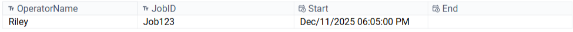
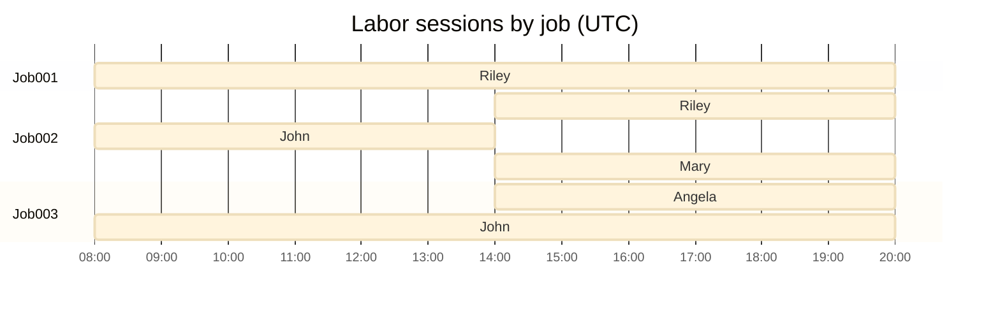

+++
date = '2025-12-15T17:00:00-06:00'
draft = false
title = 'Tulip Architecture | Labor Tracking'
tags = ["manufacturing", "MES", "Tulip", "Architecture", "SQL", "LaborTracking", "LessonsLearned"]
+++

Tulip is a great tool but it has some sharp edges that are often glossed over.  Low-code solutions can ship faster by constraining data modelling and iteration mechanics (joins, loops, and complex versioning). Having onboarded a few dozen customers, and then a year using it to help architect and implement an MES,  I have some lessons I'd like to share. This is the first of several examples I plan to share that should illustrate the strengths and weaknesses of the platform. 

This first use-case is conceptually very simple: Labor Tracking. We have an average production rate per person per hour that we'll multiply by the *number of people* on the line, multiplied by the duration of the job. Calculating the number of people on the line is the trickier part. So let's start by defining a simple data structure for operators to clock in and out. 
# Labor Tracking Schema

|   Login   |     Logout  |  OperatorID      |      JobID     |
|:--------:|:--------:|:----------:|:------:|
|   datetime     |   datetime    |   string   |  string  |


## Definitions:
* **Unique Operators**: distinct people who logged time to the job at any point.
* **Allocated FTE-hours**: total “effective labor hours” charged to the job after splitting an operator’s time across concurrent jobs
* **Staffing Factor**: average allocated FTE during the job = Allocated FTE-hours ÷ Job hours.

## Logging the Event

Using the built-in Tulip tables to store login data is easier than setting up a connector for the database. The starkest difference is how you pass the data. To interact with anything in a Tulip Table, you'll use a record placeholder. This is basically the *selected row* for the table you're working with. Whether you're creating or loading an existing record, you're going to need a `laborSessionID` for the Tulip table. When we update the record with a logout time, the operator will actually select their login record. This is the same regardless of implementation approach. 



[Tulip tables](https://support.tulip.co/docs/use-tables-in-apps) don't auto-increment a primary key (that's available to the user), so that logic lives in the application. The standard approach is to create a unique ID via the `RANDOMSTRING()` function in the [expression editor](https://support.tulip.co/docs/full-list-of-expressions-in-the-app-editor).  Once initialized, the row is automatically selected and you can initialize the record with the `Login`, `OperatorID`, and `JobID`. You'll pass each of these one at a time in the Tulip Trigger. That logic can be associated with a badge scan, a login button, etc. 

For a connector function, all of this data has to be defined ahead of time with static inputs and outputs. More detail can be found [here](https://support.tulip.co/docs/understanding-arrays-and-objects-in-connector-function-outputs-1)  Once in use within the application, these cannot be changed. You'll have to map everything with a new connector function. To highlight the difference: 
> Interactions with Tulip Tables happens one column at a time for the selected row. This can be updated any time. 
> Using a connector function for a SQL database requires mapping everything ahead of time. The schema cannot be changed without replacing the function everywhere in the application. 

If we only needed to calculate time clocked in for a given operator, then I'd recommend just using Tulip Tables. But to calculate the `staffing factor`, we have to perform that calculation for all operators logged against the job, and we need to know all the jobs they're working on during that same time. It's difficult to accomplish this natively in the platform because Tulip Tables lack proper joins. 




If you tried to implement this completely within Tulip, the easiest way would be to store the calculated fields: `Unique operators`, `session duration`, `Allocated FTE-hours`, and `Staffing Factor` in some intermediate table or against the record for the job itself. I saw one attempt at this that involved splitting jobs up into JobID_001, JobID_002, and so on when someone logged into or out of the job. All of the information above was calculated and stored against the old job at its end. That looked like a nightmare to manage, especially since looping inside of Tulip is [not trivial](https://library.tulip.co/apps/looper). 

## Breakeven

Using a real database starts to pay off as soon as we reach the end of the shift. Trying to log everyone out at the same time is simple with a connector function. Here's how I handle it: 
 
```
DECLARE
  @JobIDs      NVARCHAR(MAX)    = $JobID$, -- this can accept a list of jobIDs
  @EndTime     DATETIME         = $Logout$

IF @EndTime IS NULL
  SET @EndTime                  = GETUTCDATE();

UPDATE DBO.LaborTracking
SET
  Logout                        = @EndTime

OUTPUT
  inserted.*
WHERE
  Logout IS NULL
  AND JobID IN (
    SELECT LTRIM(RTRIM(value))
    FROM   STRING_SPLIT(@JobIDs, ',')
  );
```

## Return on Investment

Doing this with Tulip tables requires creating a named Query for the open labor records table, then an aggregation to pass the rowIDs. You'd then have to use the [looper custom widget](https://library.tulip.co/apps/looper) or an [enter-step loop](https://community.tulip.co/t/lts-8-2-step-looping-advice/9532) to add a logout time to each entry. 

Now for the calculated fields. Here's the entire function:
```
DECLARE
  @JobID    varchar(50) = $JobID$,
  @AsOfTime datetime    = GETUTCDATE();

;WITH
-- 1) Who worked on the target job
JobOperators AS (
  SELECT DISTINCT OperatorID
  FROM dbo.LaborTracking
  WHERE JobID = @JobID
),

-- 2) All jobs those operators were active on (used to detect concurrency)
OperatorJobs AS (
  SELECT DISTINCT lt.OperatorID, lt.JobID
  FROM dbo.LaborTracking lt
  JOIN JobOperators jo
    ON jo.OperatorID = lt.OperatorID
),

-- 3) Build per-operator event stream: login +1, logout -1
OperatorEvents AS (
  SELECT oj.OperatorID,
         lt.Login AS event_time,
         +1       AS delta
  FROM OperatorJobs oj
  JOIN dbo.LaborTracking lt
    ON lt.OperatorID = oj.OperatorID
   AND lt.JobID      = oj.JobID
  WHERE lt.Login IS NOT NULL

  UNION ALL

  SELECT oj.OperatorID,
         COALESCE(lt.Logout, @AsOfTime) AS event_time,
         -1                             AS delta
  FROM OperatorJobs oj
  JOIN dbo.LaborTracking lt
    ON lt.OperatorID = oj.OperatorID
   AND lt.JobID      = oj.JobID
),

-- 4) Turn events into time slices with a running "concurrent jobs" count
OperatorSlices AS (
  SELECT
    oe.OperatorID,
    oe.event_time AS slice_start,
    LEAD(oe.event_time) OVER (
      PARTITION BY oe.OperatorID
      ORDER BY oe.event_time, oe.delta
    ) AS slice_end,
    SUM(oe.delta) OVER (
      PARTITION BY oe.OperatorID
      ORDER BY oe.event_time, oe.delta
      ROWS UNBOUNDED PRECEDING
    ) AS concurrent_jobs
  FROM OperatorEvents oe
),

-- 5) Keep only slices where the operator is active on the target job
JobSlices AS (
  SELECT
    os.OperatorID,
    os.slice_start,
    os.slice_end,
    os.concurrent_jobs
  FROM OperatorSlices os
  WHERE os.slice_end IS NOT NULL
    AND EXISTS (
      SELECT 1
      FROM dbo.LaborTracking lt
      WHERE lt.JobID      = @JobID
        AND lt.OperatorID = os.OperatorID
        AND lt.Login <= os.slice_start
        AND COALESCE(lt.Logout, @AsOfTime) > os.slice_start
    )
),

-- 6) Allocated FTE-hours: sum over time of 1 / concurrent_jobs
AllocatedFTEHours AS (
  SELECT
    SUM(
      DATEDIFF(SECOND, slice_start, slice_end) / 3600.0
      / NULLIF(concurrent_jobs, 0)
    ) AS allocated_fte_hours
  FROM JobSlices
),

-- 7) How long the job ran (based on LaborTracking bounds)
JobSpan AS (
  SELECT
    DATEDIFF(SECOND,
      MIN(Login),
      MAX(COALESCE(Logout, @AsOfTime))
    ) / 3600.0 AS job_hours
  FROM dbo.LaborTracking
  WHERE JobID = @JobID
),

-- 8) “Unique workers who touched the job”
UniqueOperators AS (
  SELECT COUNT(DISTINCT OperatorID) AS unique_operators
  FROM dbo.LaborTracking
  WHERE JobID = @JobID
)

SELECT
  @JobID AS JobID,
  uo.unique_operators,
  af.allocated_fte_hours,
  af.allocated_fte_hours / NULLIF(js.job_hours, 0) AS staffing_factor
FROM AllocatedFTEHours af
CROSS JOIN JobSpan js
CROSS JOIN UniqueOperators uo;
```

The outputs are: 
* JobID
* Unique Operators
* Allocated FTE-hours
* Staffing Factor (average allocated FTE)

## Takeaways

I'm sure anyone with enough SQL experience could optimize this further, especially since `OperatorEvents` does two nearly identical joins. But the real performance gains here are on the ability to create indexes. 
```
CREATE INDEX IX_LaborTracking_Job_Op_Time ON dbo.LaborTracking (JobID, OperatorID, Login, Logout);
```
This makes our query less expensive (just window functions + some grouping), especially in my use case where no job is going to have more than 10 operators. 

Even if Tulip makes looping painless with [functions](https://support.tulip.co/docs/functions) (we'll see), I'm still not sure how you'd handle this natively with Tulip tables without significant compromise. Splitting up jobs for operators taking breaks and switching lines seems like a nightmare to manage. 

## Notes

### Datetimes are Hard
Datetimes in Tulip are painful enough to deal with inside the platform. Depending on the context, you'll see epoch times, UTC times, and datetime offsets.This is in part because datetimes are always difficult. There's some added fun from javascript, but also some Tulip-specific rough edges. So when passing datetimes through connector functions, either leave them as UTC or convert them to strings in the application **before passing them to connectors**. 

### Rounding
Tulip will round datetimes to the nearest millisecond for you. So if you're trying to use datetime2(7) to update a record e.g. with a `createdAt` timestamp, Tulip will remove any sub-millisecond times and ruin your day. See my earlier post: [time handling notes]()